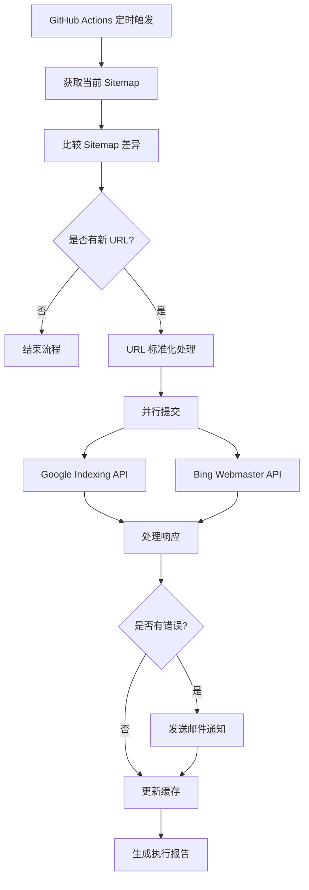

# 自动搜索引擎提交功能设计文档

## 概述

本设计文档详细描述了通过 GitHub Actions 自动检测 sitemap.xml 更新并提交新 URL 到 Google 和 Bing 搜索引擎的技术实现方案。系统将每2小时运行一次，确保新发布的文章能够及时被搜索引擎收录。

## 架构设计

### 系统架构图



### 核心组件

1. **Sitemap 检测器 (SitemapDetector)**
   - 获取当前 sitemap.xml
   - 与缓存版本比较
   - 提取新增 URL

2. **URL 标准化器 (URLNormalizer)**
   - 移除 .html 后缀
   - 验证 URL 格式
   - 去重处理

3. **搜索引擎提交器 (SearchEngineSubmitter)**
   - Google API 客户端
   - Bing API 客户端
   - 并行提交处理

4. **错误处理器 (ErrorHandler)**
   - 重试机制
   - 邮件通知
   - 错误日志

5. **缓存管理器 (CacheManager)**
   - GitHub 仓库缓存
   - 状态持久化

## 组件和接口

### SitemapDetector 组件

```javascript
class SitemapDetector {
  constructor(sitemapUrl, cacheManager) {
    this.sitemapUrl = sitemapUrl;
    this.cacheManager = cacheManager;
  }

  async detectChanges() {
    // 获取当前 sitemap
    const currentSitemap = await this.fetchSitemap();
    
    // 获取缓存的 sitemap
    const cachedSitemap = await this.cacheManager.getCachedSitemap();
    
    // 比较差异
    const newUrls = this.compareAndExtractNew(currentSitemap, cachedSitemap);
    
    return {
      newUrls,
      currentSitemap
    };
  }

  async fetchSitemap() {
    // 实现 sitemap 获取逻辑
  }

  compareAndExtractNew(current, cached) {
    // 实现差异比较逻辑
  }
}
```

### URLNormalizer 组件

```javascript
class URLNormalizer {
  static normalize(urls) {
    return urls
      .map(url => this.removeHtmlSuffix(url))
      .filter(url => this.isValidUrl(url))
      .filter((url, index, arr) => arr.indexOf(url) === index); // 去重
  }

  static removeHtmlSuffix(url) {
    return url.replace(/\.html$/, '');
  }

  static isValidUrl(url) {
    // URL 验证逻辑
    return /^https?:\/\/.+/.test(url);
  }
}
```

### SearchEngineSubmitter 组件

```javascript
class SearchEngineSubmitter {
  constructor(config) {
    this.googleClient = new GoogleIndexingClient(config.google);
    this.bingClient = new BingWebmasterClient(config.bing);
  }

  async submitUrls(urls) {
    const results = await Promise.allSettled([
      this.submitToGoogle(urls),
      this.submitToBing(urls)
    ]);

    return this.processResults(results);
  }

  async submitToGoogle(urls) {
    // Google Indexing API 提交逻辑
  }

  async submitToBing(urls) {
    // Bing Webmaster API 提交逻辑
  }
}
```

## 数据模型

### Sitemap 数据结构

```typescript
interface SitemapEntry {
  loc: string;           // URL 地址
  lastmod?: string;      // 最后修改时间
  changefreq?: string;   // 更新频率
  priority?: number;     // 优先级
}

interface SitemapData {
  urls: SitemapEntry[];
  lastFetched: Date;
  hash: string;          // 用于快速比较
}
```

### 提交结果数据结构

```typescript
interface SubmissionResult {
  engine: 'google' | 'bing';
  success: boolean;
  submittedUrls: string[];
  failedUrls: string[];
  errors: Error[];
  quota: {
    used: number;
    remaining: number;
  };
}

interface ExecutionReport {
  timestamp: Date;
  newUrlsDetected: number;
  results: SubmissionResult[];
  totalSuccess: number;
  totalFailed: number;
  executionTime: number;
}
```

### 配置数据结构

```typescript
interface Config {
  sitemap: {
    url: string;
    checkInterval: number; // 小时
  };
  google: {
    serviceAccountKey: string;
    quotaLimit: number;
  };
  bing: {
    apiKey: string;
    quotaLimit: number;
  };
  notification: {
    email: string;
    smtpConfig: SMTPConfig;
  };
  retry: {
    maxAttempts: number;
    backoffMultiplier: number;
    initialDelay: number;
  };
}
```

## 错误处理

### 错误分类和处理策略

1. **网络错误**
   - 超时：重试最多3次，指数退避
   - 连接失败：立即重试1次，然后跳过

2. **API 错误**
   - 401/403 认证错误：发送邮件通知，停止执行
   - 429 配额限制：记录状态，下次执行时继续
   - 500 服务器错误：重试2次，间隔30秒

3. **数据错误**
   - Sitemap 解析失败：发送邮件通知，使用缓存数据
   - URL 格式错误：跳过无效 URL，继续处理其他

### 重试机制实现

```javascript
class RetryHandler {
  static async withRetry(operation, config) {
    let lastError;
    
    for (let attempt = 1; attempt <= config.maxAttempts; attempt++) {
      try {
        return await operation();
      } catch (error) {
        lastError = error;
        
        if (attempt === config.maxAttempts) {
          throw error;
        }
        
        const delay = config.initialDelay * Math.pow(config.backoffMultiplier, attempt - 1);
        await this.sleep(delay);
      }
    }
  }

  static sleep(ms) {
    return new Promise(resolve => setTimeout(resolve, ms));
  }
}
```

## 测试策略

### 单元测试

1. **SitemapDetector 测试**
   - 正常 sitemap 解析
   - 差异检测准确性
   - 错误 sitemap 处理

2. **URLNormalizer 测试**
   - HTML 后缀移除
   - URL 验证逻辑
   - 去重功能

3. **SearchEngineSubmitter 测试**
   - API 调用成功场景
   - API 错误处理
   - 并发提交测试

### 集成测试

1. **端到端流程测试**
   - 完整工作流执行
   - 错误恢复测试
   - 邮件通知测试

2. **API 集成测试**
   - Google Indexing API 集成
   - Bing Webmaster API 集成
   - 配额限制测试

### 测试数据准备

```javascript
// 测试用 sitemap 数据
const mockSitemapData = {
  current: `<?xml version="1.0" encoding="UTF-8"?>
    <urlset xmlns="http://www.sitemaps.org/schemas/sitemap/0.9">
      <url>
        <loc>https://www.shareking.vip/games/new-article</loc>
        <lastmod>2024-01-15</lastmod>
      </url>
    </urlset>`,
  cached: `<?xml version="1.0" encoding="UTF-8"?>
    <urlset xmlns="http://www.sitemaps.org/schemas/sitemap/0.9">
      <url>
        <loc>https://www.shareking.vip/games/old-article</loc>
        <lastmod>2024-01-14</lastmod>
      </url>
    </urlset>`
};
```

## 部署和配置

### GitHub Actions 工作流配置

```yaml
name: Auto Search Engine Submission

on:
  schedule:
    - cron: '0 */2 * * *'  # 每2小时运行一次
  workflow_dispatch:       # 支持手动触发

env:
  SITEMAP_URL: 'https://www.shareking.vip/sitemap.xml'
  
jobs:
  submit-urls:
    runs-on: ubuntu-latest
    steps:
      - name: Checkout
        uses: actions/checkout@v4
        
      - name: Setup Node.js
        uses: actions/setup-node@v4
        with:
          node-version: '18'
          
      - name: Install dependencies
        run: npm install
        
      - name: Run URL submission
        env:
          GOOGLE_SERVICE_ACCOUNT_KEY: ${{ secrets.GOOGLE_SERVICE_ACCOUNT_KEY }}
          BING_API_KEY: ${{ secrets.BING_API_KEY }}
          NOTIFICATION_EMAIL: ${{ secrets.NOTIFICATION_EMAIL }}
          SMTP_CONFIG: ${{ secrets.SMTP_CONFIG }}
        run: node scripts/submit-urls.js
```

### 环境变量配置

需要在 GitHub Secrets 中配置以下变量：

1. `GOOGLE_SERVICE_ACCOUNT_KEY`: Google Service Account JSON 密钥
2. `BING_API_KEY`: Bing Webmaster API 密钥
3. `NOTIFICATION_EMAIL`: 接收通知的邮箱地址
4. `SMTP_CONFIG`: SMTP 服务器配置

### 缓存策略

使用 GitHub Actions Cache 存储：
- 上次的 sitemap.xml 内容
- API 配额使用情况
- 最后执行时间戳

```yaml
- name: Cache sitemap data
  uses: actions/cache@v3
  with:
    path: .cache
    key: sitemap-cache-${{ github.run_id }}
    restore-keys: sitemap-cache-
```

## 监控和维护

### 日志记录

```javascript
class Logger {
  static info(message, data = {}) {
    console.log(`[INFO] ${new Date().toISOString()} - ${message}`, data);
  }

  static error(message, error = null) {
    console.error(`[ERROR] ${new Date().toISOString()} - ${message}`, error);
  }

  static warn(message, data = {}) {
    console.warn(`[WARN] ${new Date().toISOString()} - ${message}`, data);
  }
}
```

### 性能监控

- 执行时间跟踪
- API 响应时间监控
- 成功率统计
- 配额使用监控

### 维护任务

1. **定期检查**
   - API 密钥有效性
   - 配额使用情况
   - 错误率趋势

2. **优化建议**
   - 根据网站更新频率调整检查间隔
   - 优化 sitemap 解析性能
   - 改进错误处理策略

## 安全考虑

### API 密钥管理

1. 使用 GitHub Secrets 存储敏感信息
2. 定期轮换 API 密钥
3. 最小权限原则

### 数据保护

1. 不在日志中记录敏感信息
2. 使用 HTTPS 进行所有 API 调用
3. 验证输入数据格式

### 访问控制

1. 限制 GitHub Actions 的执行权限
2. 使用专用的服务账户
3. 定期审查访问日志