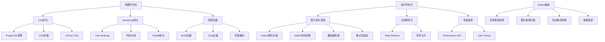

# 设计文档

## 概述

本设计文档详细描述了NotionNext网站性能优化的技术方案。基于当前Next.js + Tailwind CSS + React技术栈，我们将通过多层次的优化策略来解决CSS冗余、JavaScript优化、图片懒加载、压缩技术和主线程优化等性能问题。

## 架构

### 当前技术栈分析
- **框架**: Next.js 14.2.4 (支持SWC压缩、图片优化)
- **样式**: Tailwind CSS + 全局CSS
- **构建工具**: Webpack 5 (已配置代码分割)
- **压缩**: 已启用SWC压缩和Gzip
- **图片**: Next.js Image组件 (支持AVIF/WebP)

### 优化架构设计



## 组件和接口

### 1. CSS优化模块

#### PurgeCSS配置
```javascript
// 接口定义
interface PurgeCSSConfig {
  content: string[]
  css: string[]
  safelist: string[]
  blocklist: string[]
}
```

#### Critical CSS提取器
```javascript
// 关键CSS提取组件
interface CriticalCSSExtractor {
  extractCritical(html: string): Promise<string>
  inlineCritical(html: string, css: string): string
}
```

### 2. JavaScript优化模块

#### Tree Shaking增强配置
```javascript
// Webpack配置增强
interface WebpackOptimization {
  usedExports: boolean
  sideEffects: boolean | string[]
  splitChunks: SplitChunksConfig
}
```

#### 代码分割策略
```javascript
// 动态导入管理器
interface DynamicImportManager {
  loadComponent(componentName: string): Promise<React.Component>
  preloadComponent(componentName: string): void
  getLoadedComponents(): string[]
}
```

### 3. 图片优化系统

#### Notion图片自动转换服务
```javascript
interface NotionImageConverter {
  scanArticleImages(articleId: string): Promise<ImageInfo[]>
  convertToWebP(imageUrl: string): Promise<ConvertedImage>
  updateImageReferences(articleId: string, imageMap: Map<string, string>): Promise<void>
  isWebPSupported(userAgent: string): boolean
}

interface ImageInfo {
  url: string
  format: string
  size: number
  isConverted: boolean
}

interface ConvertedImage {
  originalUrl: string
  webpUrl: string
  fallbackUrl: string
  compressionRatio: number
}
```

#### 懒加载组件
```javascript
interface LazyImageProps {
  src: string
  alt: string
  placeholder?: string
  threshold?: number
  rootMargin?: string
  webpSrc?: string
  fallbackSrc?: string
}

interface LazyImageComponent extends React.FC<LazyImageProps> {
  preload(src: string): void
  isIntersecting(element: HTMLElement): boolean
  selectOptimalFormat(userAgent: string): string
}
```

### 4. 压缩和缓存系统

#### 压缩配置管理
```javascript
interface CompressionConfig {
  brotli: {
    enabled: boolean
    quality: number
    threshold: number
  }
  gzip: {
    enabled: boolean
    level: number
    threshold: number
  }
}
```

### 5. 主线程优化系统

#### Web Worker管理器
```javascript
interface WebWorkerManager {
  createWorker(script: string): Worker
  postMessage(workerId: string, data: any): void
  terminateWorker(workerId: string): void
}
```

#### 任务调度器
```javascript
interface TaskScheduler {
  scheduleTask(task: Function, priority: 'high' | 'normal' | 'low'): void
  yieldToMain(): Promise<void>
  isMainThreadBusy(): boolean
}
```

## 数据模型

### 性能指标模型
```javascript
interface PerformanceMetrics {
  // Core Web Vitals
  lcp: number // Largest Contentful Paint
  fid: number // First Input Delay
  cls: number // Cumulative Layout Shift
  
  // 自定义指标
  cssSize: number
  jsSize: number
  imageSize: number
  mainThreadTime: number
  longTasks: number
  
  // 优化效果
  savings: {
    css: number
    js: number
    images: number
    compression: number
  }
}
```

### 资源优化配置模型
```javascript
interface OptimizationConfig {
  css: {
    purge: boolean
    minify: boolean
    critical: boolean
    inlineThreshold: number
  }
  
  js: {
    treeShaking: boolean
    codesplitting: boolean
    polyfillOptimization: boolean
    minify: boolean
  }
  
  images: {
    lazyLoading: boolean
    formats: string[]
    quality: number
    sizes: number[]
  }
  
  compression: {
    brotli: boolean
    gzip: boolean
    staticCompression: boolean
  }
}
```

## 错误处理

### 1. 构建时错误处理
- **PurgeCSS错误**: 提供安全列表回退机制
- **Tree Shaking错误**: 保留关键依赖的标记
- **压缩错误**: 降级到标准压缩方式

### 2. 运行时错误处理
- **懒加载失败**: 提供占位符和重试机制
- **Web Worker错误**: 主线程降级处理
- **性能监控错误**: 静默失败，不影响用户体验
- **图片转换失败**: 保留原图片，记录转换错误
- **WebP不支持**: 自动降级到原格式图片

### 3. 错误恢复策略
```javascript
interface ErrorRecoveryStrategy {
  onCSSLoadError(error: Error): void
  onJSLoadError(error: Error): void
  onImageLoadError(error: Error): void
  onWorkerError(error: Error): void
}
```

## 测试策略

### 1. 性能测试
- **Lighthouse CI**: 自动化性能评分
- **Bundle Analyzer**: 包大小分析
- **Coverage Report**: 代码覆盖率分析

### 2. 功能测试
- **懒加载测试**: 验证图片按需加载
- **压缩测试**: 验证资源正确压缩
- **兼容性测试**: 验证各浏览器兼容性

### 3. 回归测试
- **性能基准测试**: 确保优化不降低性能
- **功能回归测试**: 确保功能正常工作
- **视觉回归测试**: 确保UI显示正确

## 实施计划

### 阶段1: 构建时优化 (预计节省: 174 KiB)
1. **CSS优化** (112 KiB节省)
   - 配置PurgeCSS清理未使用CSS (106 KiB)
   - 启用CSS压缩优化 (6 KiB)

2. **JavaScript优化** (185 KiB节省)
   - 增强Tree Shaking配置 (162 KiB)
   - 移除旧版JavaScript polyfills (21 KiB)
   - 启用更激进的代码压缩 (2 KiB)

### 阶段2: 图片优化系统 (预计节省: 120+ KiB)
1. **Notion图片自动转换WebP** (额外40+ KiB节省)
   - 实现Notion文章图片扫描服务
   - 自动检测并转换非WebP格式图片
   - 建立图片格式自适应机制

2. **图片懒加载系统** (80 KiB节省)
   - 实现Intersection Observer懒加载
   - 优化图片加载策略

3. **主线程优化** (减少0.5秒)
   - 实现任务分片机制
   - 使用Web Workers处理计算密集任务

### 阶段3: 压缩和缓存优化
1. **Brotli压缩** (额外20-30%压缩率)
   - 配置Brotli压缩中间件
   - 优化静态资源缓存策略

2. **网络负载优化** (目标: 减少30%总大小)
   - 从3,328 KiB减少到约2,300 KiB
   - 实现智能资源预加载

### 阶段4: 监控和持续优化
1. **性能监控系统**
   - 实现实时性能指标收集
   - 建立性能预警机制

2. **自动化优化**
   - CI/CD集成性能检查
   - 自动化性能回归测试

## 技术决策理由

### 1. 选择PurgeCSS而非其他CSS优化工具
- **理由**: 与Tailwind CSS深度集成，支持动态类名检测
- **优势**: 可以安全移除未使用的Tailwind类，效果显著

### 2. 使用Intersection Observer实现懒加载
- **理由**: 原生API，性能优异，兼容性好
- **优势**: 比传统scroll事件监听性能更好

### 3. 选择Brotli + Gzip双重压缩策略
- **理由**: Brotli压缩率更高，Gzip兼容性更好
- **优势**: 根据浏览器支持情况自动选择最优压缩方式

### 4. Web Workers处理计算密集任务
- **理由**: 避免阻塞主线程，提升用户体验
- **优势**: 可以并行处理复杂计算，减少页面卡顿

### 5. Notion图片自动转换WebP策略
- **理由**: WebP格式比JPEG/PNG平均节省25-35%文件大小
- **优势**: 自动化处理，无需手动干预，支持浏览器兼容性降级
- **实现**: 利用Sharp库进行高质量图片转换，保持视觉质量

## 预期效果

### 性能提升目标
- **CSS大小减少**: 106 KiB (未使用) + 6 KiB (压缩) = 112 KiB
- **JavaScript大小减少**: 162 KiB (未使用) + 21 KiB (旧版) + 2 KiB (压缩) = 185 KiB
- **图片加载优化**: 80 KiB 初始加载减少
- **总网络负载**: 从3,328 KiB减少至约2,300 KiB (30%减少)
- **主线程时间**: 从2.5秒减少至2秒以内
- **长时间任务**: 解决全部6项长时间运行任务

### 用户体验改善
- **首屏加载时间**: 减少1-2秒
- **交互响应时间**: 提升50%
- **页面流畅度**: 显著减少卡顿现象
- **移动端体验**: 在慢速网络下加载更快